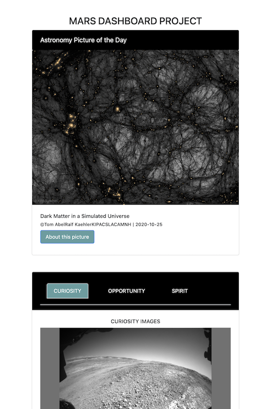

# mars-dashboard
This is the second project of the Udacity Advanced Javascript Nanodegree Program.
To run this program please add your API key of the NASA API in the .env file, if you don't have one you can create it in the following link https://api.nasa.gov/.
1. Run the Yarn install command
2. Run the Yarn start command

You should see the following view.

